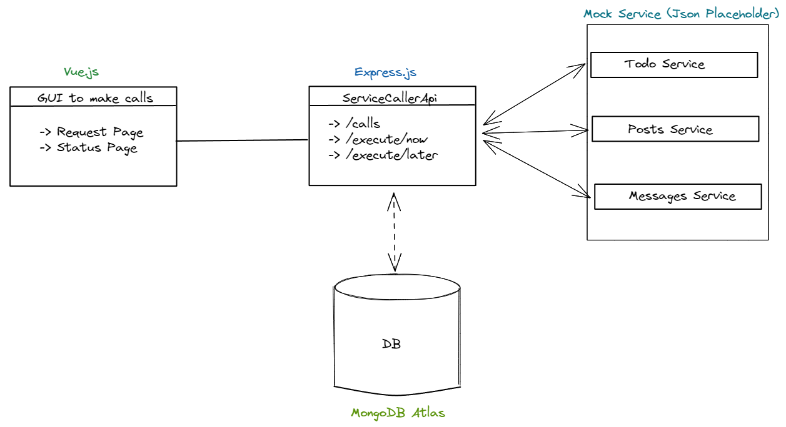
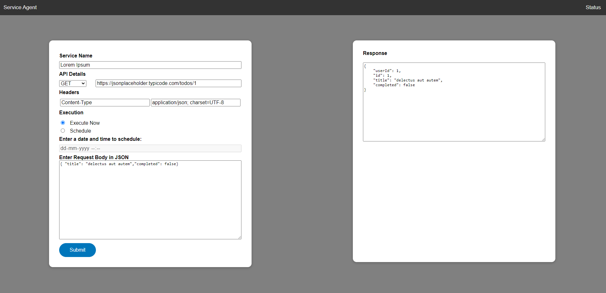

# Unified-API-Caller

Developed an microservice which makes service calls to specified services. Express.JS framework has been used to expose a RESTful API to make service calls.

Note :- Mock Services from [JSON Placeholder](https://jsonplaceholder.typicode.com/)  have been considered for this project to fake API for the pupose of testing and prototyping.  



# Tech Stack 

- Express.js for Server.
- Node.js for API development.
- MongoDB Atlas for Database to Store Service calls.
- Mongoose ODM for data queries and connection.
- Eslint for using standard appraoch for all coding style and Variables. 
- Postman is used to hit the API's and also used for the documentation.
- Vue.js for client side development.

# How to Run the Application

Steps to Follow:-

* Clone this repository using `git clone https://github.com/mohammedshariqnawaz/Unified-API-Caller.git`

## Run Backend
* Change directory using `cd .\backend\ApiManagerService`
* Install required packages uisng `npm install`
* Run `npm start` to make backend available on `https://localhost:3000/`

## Run Frontend 
* Change directory using `cd .\frontend\api-caller-gui`
* Install required packages uisng `npm install`
* Run `npm run serve` to make backend available on `https://localhost:8080/`

# API Endpoints

List of available routes:

`POST api/execute/now` - Create a service call immediately\
`POST api/execute/later` - Schedule a service call on a given date and time\
`GET api/calls` - Get all service calls\

### Payload 
```javascript
{
    serviceId: '4448dc95-5695-4850-b21e-35385d133449',
    serviceName: 'Lorem Ipsum',
    apiMethod: 'GET',
    apiEndpoint: 'https://jsonplaceholder.typicode.com/todos/1',
    apiHeaders: [{
        key: 'Content-Type',
        value: 'application/json; charset=UTF-8'
    }],
    apiBody: '{ "title": "delectus aut autem","completed": false}',
    apiExecuteNow: true,
    dateTime: '2022-10-18T11:35:31.906Z'
}
```

# Demo - API Endpoints Usage Screenshot with Frontend


